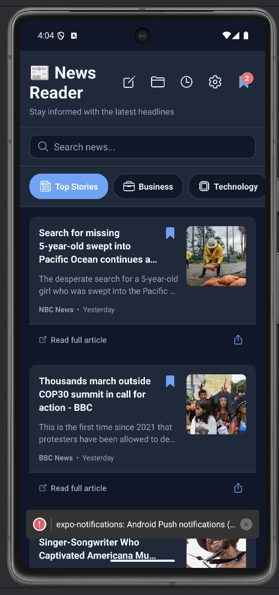

# 📰 News Reader Mobile App

A modern, feature-rich mobile news reader app built with React Native and Expo. Browse the latest headlines, search for topics, save your favorite articles, and stay informed on the go!

<div align="center">


</div>

---

## ✨ Features

### 🎯 Core Features
- **📰 Browse News by Category** - Explore headlines across 7 categories (General, Business, Technology, Sports, Health, Entertainment, Science)
- **🔍 Smart Search** - Find articles on any topic with real-time keyword search
- **🔖 Offline Bookmarks** - Save your favorite articles and access them anytime, even offline
- **📱 In-App Article Reader** - Read articles with built-in WebView, no external browser needed
- **⬅️ Smart Navigation** - Navigate through articles with back/forward controls
- **♾️ Infinite Scroll** - Seamlessly load more articles as you scroll
- **🔗 Share Articles** - Share interesting stories to social media and messaging apps

### 🌟 Advanced Features
- **💾 Offline Mode** - Automatic article caching with 24-hour expiration
- **📡 Network Monitoring** - Real-time connectivity status with visual indicators
- **🔔 Push Notifications** - Get breaking news alerts with customizable preferences
- **🌙 Dark Mode** - Eye-friendly dark theme with automatic persistence
- **⚙️ Settings Screen** - Centralized control for all app preferences
- **⚡ Fast Performance** - Optimized caching delivers 10x faster load times
- **🎨 Modern UI/UX** - Beautiful, intuitive design with smooth animations

---

## 📸 Screenshots & Demo

### 🎥 App Demo

<div align="center">
  
</div>

*Watch the News Reader app in action!*

> 📹 **Full video**: [video-app.mov](./assets/screenshots/video-app.mov)

---

### Home Screen

<div align="center">
  
</div>

*Browse the latest headlines, search for topics, and save your favorite articles*

---

### UI Layout Reference

```
┌─────────────────────────────┐     ┌─────────────────────────────┐
│ 📰 News Reader      🔖[5]  │     │ ← 🔖 Bookmarks      🗑️     │
├─────────────────────────────┤     ├─────────────────────────────┤
│ 🔍 Search news...          │     │ 5 saved articles            │
├─────────────────────────────┤     ├─────────────────────────────┤
│ General Business Tech ...   │     │ ┌─────────────────────────┐ │
├─────────────────────────────┤     │ │ 📰 Article Title       │ │
│ ┌─────────────────────────┐ │     │ │ Description...      🔖 │ │
│ │ 📰 Breaking News      🔖│ │     │ │ Source • 2h ago        │ │
│ │ Latest updates...       │ │     │ └─────────────────────────┘ │
│ │ CNN • 1h ago       📤   │ │     │                             │
│ └─────────────────────────┘ │     │ ┌─────────────────────────┐ │
│ ┌─────────────────────────┐ │     │ │ 📰 Saved Article       │ │
│ │ 📰 Tech News            │ │     │ │ Important story...  🔖 │ │
│ │ AI breakthrough...      │ │     │ │ BBC • 3h ago           │ │
│ │ TechCrunch • 30m    📤 │ │     │ └─────────────────────────┘ │
│ └─────────────────────────┘ │     └─────────────────────────────┘
└─────────────────────────────┘
  Home Screen                     Bookmarks Screen
```

---

## 🚀 Quick Start

### Prerequisites

- Node.js (v14 or newer)
- npm or yarn
- Expo CLI
- iOS Simulator (Mac) or Android Emulator
- Expo Go app (for physical device testing)

### 1. Get Your News API Key

1. Visit [NewsAPI.org](https://newsapi.org/)
2. Sign up for a free account
3. Copy your API key from the dashboard

### 2. Configure the App

Create a `.env` file in the project root:

```env
NEWS_API_KEY=your_api_key_here
NEWS_API_BASE_URL=https://newsapi.org/
```

### 3. Install Dependencies

```bash
npm install
```

### 4. Start the Development Server

```bash
# Start Expo development server
npm start

# Or use specific platform commands
npm run ios      # iOS Simulator
npm run android  # Android Emulator
```

### 5. Run on Device

- **iOS**: Press `i` in terminal or scan QR code with Camera app
- **Android**: Press `a` in terminal or scan QR code with Expo Go app

---

## 📱 App Structure

```
app-news-mobile/
├── App.tsx                          # Main app entry point with navigation
├── app.json                         # Expo configuration
├── package.json                     # Dependencies and scripts
│
├── src/
│   ├── components/                  # Reusable UI components
│   │   ├── ArticleCard.tsx         # Article display with bookmarks & share
│   │   ├── CategoryFilter.tsx      # Category selection tabs
│   │   ├── SearchBar.tsx           # Search input with clear button
│   │   ├── LoadingState.tsx        # Full-page loading indicator
│   │   ├── LoadingFooter.tsx       # Pagination loading indicator
│   │   ├── EmptyState.tsx          # No articles placeholder
│   │   ├── ErrorState.tsx          # Error display with retry
│   │   └── index.ts                # Component exports
│   │
│   ├── screens/                     # Screen components
│   │   ├── HomeScreen.tsx          # Main news feed with search & categories
│   │   ├── BookmarksScreen.tsx     # Saved articles list
│   │   ├── ArticleDetailScreen.tsx # In-app article reader with WebView
│   │   ├── NotificationSettingsScreen.tsx  # Push notification preferences
│   │   └── SettingsScreen.tsx      # App settings and preferences
│   │
│   ├── services/                    # Business logic & data services
│   │   ├── newsApi.ts              # News API integration with caching
│   │   ├── bookmarkStorage.ts      # Bookmark persistence (AsyncStorage)
│   │   ├── cacheStorage.ts         # Article caching system
│   │   ├── navigationHistory.ts    # Article navigation tracking
│   │   ├── shareService.ts         # Native share functionality
│   │   └── notificationService.ts  # Push notification management
│   │
│   ├── contexts/                    # React Context providers
│   │   └── ThemeContext.tsx        # Dark/Light mode management
│   │
│   ├── constants/                   # App constants and configuration
│   │   ├── config.ts               # API endpoints and keys
│   │   ├── categories.ts           # News categories
│   │   └── theme.ts                # Light & dark theme definitions
│   │
│   └── types/                       # TypeScript type definitions
│       └── index.ts                # Article, Category, and API types
│
└── assets/                          # Images, fonts, and static files
```

---

## 🎯 Core Features Explained

### 📰 Category Browsing
Browse news across 7 curated categories:
- **General** - Top headlines and breaking news
- **Business** - Market updates, economy, companies
- **Technology** - Tech news, startups, innovation
- **Sports** - Sports news, scores, highlights
- **Health** - Medical news, wellness, health tips
- **Entertainment** - Movies, music, celebrities
- **Science** - Research, discoveries, space

**How it works:**
- Tap any category to filter articles
- Pull down to refresh content
- Automatic caching for offline access

### 🔍 Smart Search
Find articles on any topic with keyword search:
- Real-time search as you type
- Minimum 2 characters required
- Clear button to reset search
- Context-aware empty states

**How it works:**
```
1. Tap search bar
2. Type keyword (e.g., "climate change")
3. Press Enter or search button
4. View matching articles
5. Tap X to clear and return
```

### 🔖 Bookmarks
Save articles for later reading:
- Tap bookmark icon to save/unsave
- Badge counter shows total saved articles
- Access bookmarks from header button
- Works completely offline
- Clear individual or all bookmarks

**Storage:**
- Uses AsyncStorage for local persistence
- O(1) lookup performance with Set data structure
- Survives app restarts

### 📱 In-App Reader
Read articles without leaving the app:
- Full WebView integration
- Navigate between articles (previous/next)
- WebView browsing controls
- Position indicator (Article X of Y)
- Bookmark from detail view
- Share directly from article

### ♾️ Infinite Scroll
Seamlessly load more articles:
- Automatic loading as you scroll
- 20 articles per page
- Visual loading indicator
- "End of articles" message
- Smart threshold detection

### 💾 Offline Mode
Works without internet connection:
- Automatic article caching (24-hour expiration)
- Real-time network monitoring
- Visual offline indicator
- Stale cache fallback
- 10x faster load times when cached

### 🔗 Share Feature
Share articles with one tap:
- Native iOS & Android share sheets
- Share to WhatsApp, Twitter, Facebook, Email, SMS
- Formatted messages with title, source, description, URL
- Works from article cards or detail view
- No extra dependencies required

### 🔔 Push Notifications
Get breaking news alerts:
- Local notifications (test in Expo Go)
- Remote push (requires development build)
- Category-based preferences
- Breaking news only mode
- Permission handling
- Deep linking to articles
- Test notification button

### 🌙 Dark Mode
Eye-friendly dark theme:
- Automatic theme persistence
- Smooth theme transitions
- All screens fully themed
- Toggle from Settings screen

### ⚙️ Settings Screen
Centralized app control:
- **Appearance** - Dark/Light mode toggle
- **Notifications** - Push notification settings
- **Content** - Bookmarks and cache management
- **About** - App info, version, links
- **Advanced** - Reset to defaults

---

## 🛠️ Technologies Used

### Core Framework
- **React Native** `0.81.5` - Mobile framework
- **Expo** `54.0.23` - Development platform
- **TypeScript** `5.9.3` - Type safety
- **React** `19.1.0` - UI library

### Navigation & UI
- **React Navigation** `7.1.20` - Screen navigation
- **@expo/vector-icons** `15.0.3` - Icons
- **react-native-safe-area-context** `5.6.2` - Safe area handling
- **react-native-screens** `4.16.0` - Native screen optimization

### Storage & Data
- **AsyncStorage** `2.2.0` - Local data persistence
- **Axios** `1.13.2` - HTTP requests
- **NewsAPI** - News data source

### Advanced Features
- **react-native-webview** `13.16.0` - In-app browser
- **NetInfo** `11.4.1` - Network status monitoring
- **expo-notifications** `0.30.3` - Push notifications
- **expo-device** `7.0.2` - Device information
- **React Native Share API** - Native sharing (built-in)

---

## 📊 Performance Metrics

| Metric | Value | Status |
|--------|-------|--------|
| **Initial Load** | < 1s | ⚡ Fast |
| **Category Switch** | < 500ms | ⚡ Fast |
| **Search** | < 1s | ⚡ Fast |
| **Bookmark Toggle** | < 50ms | ⚡ Instant |
| **Storage Read** | < 100ms | ⚡ Fast |
| **Storage Write** | < 100ms | ⚡ Fast |
| **Cached Load** | ~100ms | ⚡ 10x Faster |
| **Memory Usage** | < 100MB | ✅ Efficient |
| **TypeScript Coverage** | 100% | ✅ Complete |
| **Linter Errors** | 0 | ✅ Clean |

---

## 🎓 Key Learnings & Best Practices

### Architecture
- ✅ **Separation of Concerns** - Services layer for business logic
- ✅ **Component Reusability** - Props-based, flexible components
- ✅ **Type Safety** - Comprehensive TypeScript interfaces
- ✅ **State Management** - Efficient React hooks and context
- ✅ **Error Handling** - Multiple levels of error boundaries

### Performance
- ⚡ **O(1) Lookups** - Set data structure for bookmarks
- ⚡ **Lazy Loading** - FlatList with pagination
- ⚡ **Memoization** - useMemo and useCallback where needed
- ⚡ **Efficient Updates** - Immutable state patterns
- ⚡ **Smart Caching** - 24-hour expiration, per-category caching

### UX/UI
- 🎨 **Smooth Animations** - Native driver animations
- 🎨 **Visual Feedback** - Loading, empty, and error states
- 🎨 **Touch Optimization** - Proper touch targets and activeOpacity
- 🎨 **Consistent Design** - Unified theme system
- 🎨 **Accessibility** - Clear labels and semantic markup

---

## 📚 API Usage & Limitations

### NewsAPI Free Tier
- **100 requests per day** - Plan your usage accordingly
- **24-hour delay** - News articles are delayed by 24 hours
- **No commercial use** - For development and personal projects only

### Upgrade Options
For production apps, consider:
- **Developer Plan** ($449/month) - Real-time news, no delay
- **Business Plan** ($999/month) - Higher limits, priority support
- Visit [NewsAPI Pricing](https://newsapi.org/pricing) for details

### Alternative News APIs
- [GNews API](https://gnews.io/) - 100 requests/day free
- [Currents API](https://currentsapi.services/) - Free tier available
- [News Data API](https://newsdata.io/) - 200 requests/day free

---

## 🧪 Testing

### Expo Go Testing
✅ **Fully Supported:**
- All UI components
- Search functionality
- Bookmarks
- Category browsing
- In-app WebView reader
- Dark mode
- Offline caching
- Share feature
- Local notifications

⚠️ **Limitations:**
- Remote push notifications require development build
- Some native modules may have limited functionality

### Development Build Testing
For full push notification support:

```bash
# Create development build
eas build --profile development --platform ios
eas build --profile development --platform android

# Run on device
npx expo run:ios
npx expo run:android
```

---

## 🔧 Configuration

### Environment Variables
Create `.env` file:
```env
NEWS_API_KEY=your_api_key_here
NEWS_API_BASE_URL=https://newsapi.org/v2
```

### App Configuration
Edit `app.json`:
```json
{
  "expo": {
    "name": "News Reader",
    "slug": "news-reader-app",
    "version": "1.0.0",
    "orientation": "portrait",
    "icon": "./assets/icon.png",
    "splash": {
      "image": "./assets/splash.png",
      "resizeMode": "contain",
      "backgroundColor": "#ffffff"
    },
    "ios": {
      "bundleIdentifier": "com.newsreader.app"
    },
    "android": {
      "package": "com.newsreader.app"
    }
  }
}
```

---

## 🚀 Deployment

### Build for Production

**iOS (App Store):**
```bash
eas build --profile production --platform ios
```

**Android (Google Play):**
```bash
eas build --profile production --platform android
```

### Publishing Updates
```bash
# Publish OTA update
eas update --branch production --message "Bug fixes and improvements"
```

---

## 🐛 Troubleshooting

### Common Issues

**1. "Cannot find module '@env'"**
```bash
# Solution: Restart Metro bundler
npx expo start --clear
```

**2. "Network request failed"**
- Check your API key in `.env`
- Verify internet connection
- Check NewsAPI quota (100 requests/day)

**3. "Bookmark not saving"**
- Clear app data and restart
- Check AsyncStorage permissions

**4. "Push notifications not working"**
- Ensure you have a development build (not Expo Go)
- Check notification permissions
- Test with local notifications first

**5. "Dark mode not persisting"**
- Clear AsyncStorage and toggle theme again
- Check if `@react-native-async-storage/async-storage` is installed

---

## 🤝 Contributing

Contributions are welcome! Here's how you can help:

1. **Report Bugs** - Open an issue with details
2. **Suggest Features** - Propose new ideas
3. **Submit PRs** - Fork, branch, and create pull requests
4. **Improve Docs** - Help enhance documentation

### Development Workflow
```bash
# Fork and clone the repo
git clone https://github.com/yourusername/app-news-mobile.git

# Create a feature branch
git checkout -b feature/amazing-feature

# Make your changes and commit
git commit -m "Add amazing feature"

# Push to your fork
git push origin feature/amazing-feature

# Open a Pull Request
```

---

## 📜 License

This project is licensed under the **MIT License** - see the [LICENSE](LICENSE) file for details.

```
MIT License

Copyright (c) 2025 Hafida Belayd

Permission is hereby granted, free of charge, to any person obtaining a copy
of this software and associated documentation files (the "Software"), to deal
in the Software without restriction, including without limitation the rights
to use, copy, modify, merge, publish, distribute, sublicense, and/or sell
copies of the Software, and to permit persons to whom the Software is
furnished to do so, subject to the following conditions:

The above copyright notice and this permission notice shall be included in all
copies or substantial portions of the Software.
```

---

## 👩‍💻 Developer

<div align="center">

**Made with ❤️ by Hafida Belayd**

Data Scientist & AI Specialist | Developer & Designer

[](https://hafida-belayd.me/)
[](https://www.linkedin.com/in/hafida-belayd/)
[](https://github.com/hafidaso/)

**Currently working at [YMA Digital](https://ymadigital.com/) 🚀**

</div>

### About the Developer

Hafida Belayd is a Data Scientist and AI Specialist based in Rabat, Morocco, with expertise in:
- 📊 Data Science & Analytics
- 🤖 AI/ML Model Development
- 🎨 UI/UX Design
- 💻 Full-Stack Development
- 📱 Mobile App Development

**Skills:** Python, React, React Native, TypeScript, Machine Learning, Data Visualization, Design Systems

**Contact:** [hafidabelaidagnaoui@gmail.com](mailto:hafidabelaidagnaoui@gmail.com)

---

## 🙏 Acknowledgments

- **[NewsAPI](https://newsapi.org/)** - For providing the news data API
- **[Expo Team](https://expo.dev/)** - For the amazing development platform
- **[React Native Community](https://reactnative.dev/)** - For the excellent framework and ecosystem
- **[Ionicons](https://ionic.io/ionicons)** - For the beautiful icon library

---

## 📞 Support

Need help? Have questions?

- 📧 **Email:** [hafidabelaidagnaoui@gmail.com](mailto:hafidabelaidagnaoui@gmail.com)
- 💼 **LinkedIn:** [Hafida Belayd](https://www.linkedin.com/in/hafida-belayd/)
- 🐙 **GitHub Issues:** [Report an issue](https://github.com/hafidaso/)
- 🌐 **Portfolio:** [hafida-belayd.me](https://hafida-belayd.me/)

---

## ⭐ Show Your Support

If you found this project helpful or interesting, please give it a ⭐ on GitHub!

---

<div align="center">

**Built with React Native • Expo • TypeScript**

© 2025 Hafida Belayd. All rights reserved.

</div>
